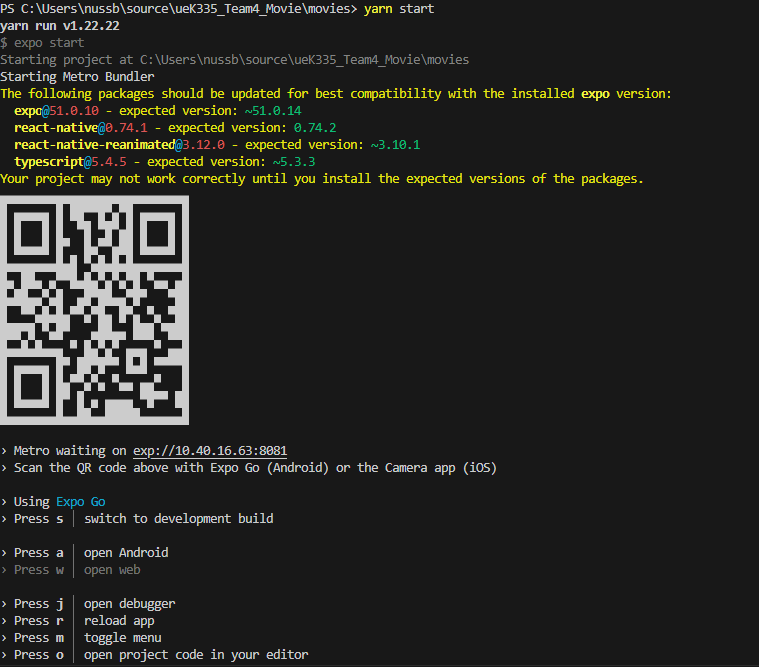

# ueK335_Team4_Movie

## Ressourcen
Figma: https://www.figma.com/design/yUHXi9jP3VPuduXMmPDf1f/Movie-Details-Checker-Mock-Up
Dokumentation: https://drive.google.com/drive/folders/1Q_4LlRswobYIhVVBqh7ILfECDwpeEYUC?usp=sharing

## Installations Anleitung
### 1. Git Repository Klonen

```bash
git clone https://github.com/nussbaumerv/ueK335_Team4_Movie
```

### 2. Installation
Öffne den Ordner movies im frisch geklonten Repository.
In der Kommandozeile gib folgenden Befehl ein:
```bash
cd ueK335_Team4_Movie/movies
yarn install 
```
### 3. Start der Applikation
Nach der erfolgreichen Installation der Pakete kann die Applikation nun gestartet werden.
Folgender Befehl muss eingegeben werden.

```bash
yarn start 
```

### 4. Applikation öffnen
Lade nun aus dem Apple App Store oder Google Play Store folgende Applikation herunter: [Expo Go App](https://expo.dev/go)

Nachdem der Schritt drei ausgeführt wurde, sollte so ein QR-Code erscheinen:


Dieser muss in IOS über die Kamera-App gescannt werden und in Android in der Expo Go App selbst.

**Wichtig: Das Smartphone und der Laptop, wo das Programm läuft, müssen sich im gleichen Netzwerk befinden.**

Gratulation, 🎉 Die App sollte jetzt funktionieren. Bei Fragen kontaktieren Sie bitte nussbaumerv9@gmail.com.
